# Template Matching for Correlation and Localisation of Multiple Sensor Types in Unstructured Environments for Traversability Assessment

> **MSc by Research** — William Buchan, Cranfield University, School of Aerospace, Transport and Manufacturing (September 2024)
>
> Supervisors: Professor Argyrios Zolotas & Dr Gilbert Tang

A sensor-agnostic localisation method that uses edge detection and template matching to align vehicle-mounted 3D sensor data (radar/LIDAR point clouds) with wide-area overhead imagery (satellite/UAV) — without deep learning or labelled datasets.

<p align="center">
  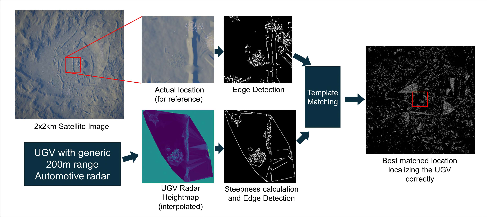
</p>
<p align="center"><em>Figure 1.1 — Overview of Localisation Methodology</em></p>

**Keywords:** Traversability, Localisation, Automotive Radar, LIDAR, Template Matching, Edge Detection, Unstructured Environments, Sensor Fusion

---

## Table of Contents

- [Abstract](#abstract)
- [Motivation](#motivation)
- [Background: Sensors and Platforms](#background-sensors-and-platforms)
  - [LIDAR](#lidar)
  - [Radar](#radar)
  - [Cameras](#cameras)
  - [Platform Comparison](#platform-comparison)
- [Research Gap](#research-gap)
- [Methodology Overview](#methodology-overview)
- [Chapter 3 — Early Map Localisation Work](#chapter-3--early-map-localisation-work)
  - [Pathfinding in Segmented Maps](#pathfinding-in-segmented-maps)
  - [Simulation Environment (UE5)](#simulation-environment-ue5)
  - [Data Format Normalisation](#data-format-normalisation)
  - [Free Space Estimation](#free-space-estimation)
- [Chapter 4 — Generalised Noise Robustness Testing](#chapter-4--generalised-noise-robustness-testing)
  - [Methodology](#generalised-methodology)
  - [Noise Types](#noise-types)
  - [Template Matching Algorithm](#template-matching-algorithm)
  - [Results](#generalised-results)
- [Chapter 5 — Simulated Radar Localisation Testing](#chapter-5--simulated-radar-localisation-testing)
  - [Simulation Framework](#simulation-framework)
  - [Simulated Sensors](#simulated-sensors)
  - [Overhead Image Pre-Processing](#overhead-image-pre-processing)
  - [3D Point Cloud Pre-Processing](#3d-point-cloud-pre-processing)
  - [Methodology](#simulated-methodology)
  - [Results](#simulated-results)
- [Chapter 6 — Discussion and Future Research](#chapter-6--discussion-and-future-research)
- [Chapter 7 — Conclusion](#chapter-7--conclusion)
- [Replication Guide](#replication-guide)
  - [Prerequisites](#prerequisites)
  - [Quick Start](#quick-start)
  - [Script 1: generate_all_data.py](#script-1-generate_all_datapy)
  - [Script 2: run_ue5_test.py](#script-2-run_ue5_testpy)
  - [Script 3: run_generalised_test.py](#script-3-run_generalised_testpy)
  - [Data Format Reference](#data-format-reference)
  - [Directory Structure](#directory-structure)
- [Key Equations](#key-equations)
- [Citation](#citation)
- [License](#license)

---

## Abstract

This research explores the use of template matching algorithms to combine datasets of multiple sensor types, from multiple platforms, for enhanced situational awareness and traversability estimation in unstructured environments. Classification of environments for traversability is most effective when combining visual information best captured by cameras, and 3D shape information best captured by sensors such as Radar and LIDAR. Likewise, sensor platforms such as unmanned aerial vehicles (UAVs) can gather data from a far wider area than a traversing ground vehicle alone. When the relative positions of the vehicles are unknown, localisation (alignment) must be performed. The proposed method leverages generic template matching and image processing techniques, such as edge detection, to robustly align and merge terrain maps from different sensor types. The viability of the approach is validated by effectively aligning virtual radar and satellite data from an unstructured simulation environment.

---

## Motivation

In unstructured environments, vehicles must navigate unpredictable terrain and operate without reliable infrastructure for guidance. Recent advances have focused primarily on structured settings such as roads or buildings — obstacle detection, emergency braking, lane assist. Similar tools for unstructured environments promise to greatly improve the safety and effectiveness of many key use cases: firefighting vehicles tackling wildfires in off-road environments can encounter low visibility due to smoke; NASA's Perseverance Rover on Mars must negotiate harsh terrain with significant communication delays.

To navigate effectively, vehicles need accurate traversability analysis — an assessment of which paths are passable and how difficult or risky each path might be. Geometric data from 3D scans (LIDAR, radar) provides detailed understanding of obstacles and terrain slopes. Yet geometry alone does not reveal surface composition — grass, mud, sand, or gravel each poses a different traction challenge. Visual data from cameras can fill that gap by classifying surface types, but cameras often lack precision at longer distances and degrade in adverse weather.

Combining multiple sensor types, and sometimes data from external platforms such as drones and satellites, is essential to generate a full picture of the environment. A core challenge in combining data sources, especially from separate platforms, is locating the vehicle within the datasets. Many state-of-the-art localisation systems use machine learning models that require large volumes of labelled data — extremely challenging and costly to collate, particularly for radar in unstructured environments. These networks also lack generalisation between different sensor types.

---

## Background: Sensors and Platforms

### LIDAR

LIDAR provides millimetre-precision 3D scans with resolution and accuracy that other sensors cannot match, but at much higher cost. It uses the same visual light spectrum as cameras, so it also struggles with low visibility conditions such as fog or smoke — moderate rain can reduce detection distance by up to 69%. The data is a point cloud, incompatible with widespread computer vision segmentation models used for cameras. Algorithms studied for unstructured environments include KPConv, Cylinder3D, SalsaNext, and SphereFormer. SphereFormer excels at using global context (e.g., classifying a tree by seeing it start on the ground and grow upwards), and transformer-based models are likely to be the algorithms of choice going forward. Beyond point cloud shape, modern multispectral LIDAR systems can also perform material classification through spectrum analysis.

### Radar

Radar (77 GHz band) has gained increasing attention for autonomous navigation due to its robustness in adverse weather. Unlike cameras and LIDAR, radar utilises radio waves in the microwave or millimetre-wave frequency range, allowing it to penetrate fog, rain, snow, and dust. It has a much longer range than LIDAR (hundreds of metres) and is drastically cheaper. The resolution is lower (centimetre-range), and radar beams interact with materials differently — passing through light foliage, seeing through small gaps, and producing multipath reflections from surrounding surfaces. The point cloud output is similar to LIDAR but lower resolution and less precise.

Radar-based terrain classification systems can distinguish between terrain types despite reduced resolution — solid obstacles like rocks produce higher intensity reflections and distinct structural features; dense vegetation produces lower intensity and more dispersed return patterns. Radar can also measure soil moisture levels and classify materials based on reflected radar signatures.

### Cameras

Cameras provide high resolution visual information. Advancements in computer vision have enabled robust visual odometry and SLAM using monocular cameras (ORB-SLAM3), though depth estimation from monocular images remains challenging in unstructured environments with limited texture. Stereo cameras improve depth perception but are sensitive to calibration errors and limited to roughly 10 metres range. Thermal cameras can operate in low-light and through some smoke/fog. Object detection models like YOLOv8 perform well on camera data but their effectiveness in unstructured environments is limited by the lack of distinct features and boundaries between foliage foreground and background.

### Platform Comparison

| Platform | Field of View | Sensor Payload | Processing Power | Resolution | Mobility |
|---|---|---|---|---|---|
| Mission Vehicle | Low | Large | High | High | Low |
| UAV Scout | High | Small | Low | High | High |
| UGV Scout | Low | Large | High | High | Medium |
| Satellite/Map Data | Infinite | N/A | Effectively Infinite (pre-processed) | Low | N/A |

### Sensor Occlusion by Weather

| Sensor | Wavelength | Resolution | Rain | Fog | Dust | Smoke |
|---|---|---|---|---|---|---|
| Visual band camera | 390–750 nm | High | High | High | High | High |
| Infrared camera | 850–950 nm | High | Medium | Medium | High | High |
| Thermal band | 7–14 μm | High | Medium | Medium | High | Medium |
| LIDAR | 750–1500 nm | Low | Low | Low | High | High |
| Radar (77 GHz) | 4 mm | Very Low | None | None | None | None |

Satellite imagery provides vastly broader context — services like Up42 provide twice-daily global coverage at 30 cm resolution. Pre-existing maps (OpenStreetMap, etc.) can also be used with pre-processing. UAVs offer scouting capability but are limited by flight time, communication, and payload. Scout UGVs can physically interact with terrain, giving ground-truth traversability readings through IMU data.

<p align="center">
  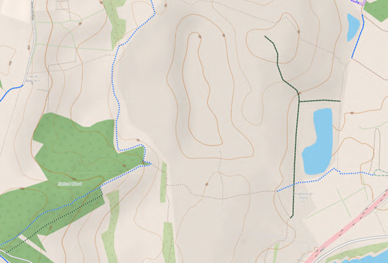
</p>
<p align="center"><em>Figure 2.1 — OpenStreetMap area example including terrain contours, water and wooded areas</em></p>

---

## Research Gap

Existing localisation solutions rely on either deep learning (requiring large labelled datasets not widely available for unstructured environments) or geometric feature extraction (edges, corners, trunk circles) that is more effective in structured environments with distinct features like walls and corners. In unstructured environments, neither is optimal. Deep learning struggles where distinct features like clear edges and corners are much less numerous, and systems like NetVlad and CVM-net cannot use non-visual sensor data such as LIDAR or radar. This indicates a research gap for a method that does not require deep learning, is sensor-independent, and can work from both point cloud data and top-down images.

---

## Methodology Overview

```
┌─────────────────────┐      ┌───────────────────────────┐
│  Vehicle Sensor      │      │  Overhead / Satellite     │
│  (Radar, LIDAR, etc) │      │  Imagery                  │
└─────────┬───────────┘      └────────────┬──────────────┘
          │                               │
          ▼                               ▼
   Point cloud → Heightmap         RGB → Greyscale
          │                               │
          ▼                               ▼
   Steepness calculation           Canny edge detection
          │                               │
          ▼                               ▼
   Canny edge detection            Edge-detected target
          │                               │
          ▼                               ▼
   Edge-detected template ──────► TM_CCOEFF_NORMED
                                          │
                                          ▼
                                  Best match location
                                  = vehicle position
```

The approach converts any sensor output into a 2D edge-detected image at a common spatial resolution (1 meter per pixel), then uses OpenCV's `TM_CCOEFF_NORMED` normalised cross-correlation to find the best match location. By converting the sensor data to edge-detected images, the features that differentiate areas — shapes and outlines of objects — are shown in a format that is agnostic to the original sensor type. The vehicle map (smaller) is the "template" and the external map (larger) is the "target". Since the vehicle knows where it is within its own sensor map, a successful match tells it where it is within the external map.

Key advantages: no deep learning, no labelled training data, no sensor-specific architectures, uses only generic image processing libraries (OpenCV, NumPy).

---

## Chapter 3 — Early Map Localisation Work

### Pathfinding in Segmented Maps

The first investigation assessed using pre-segmented maps such as OpenStreetMap for traversability estimation. Area polygons were rasterised into a grid with classification-based weighting, and pathfinding algorithms (A-star and Dijkstra's) were used to find the lowest weight path. Dijkstra's is proposed as most useful for pre-processed maps — once the navigation graph is made, paths between any two points are determined much faster than A-star. After localisation, the navigation graph can be updated locally as the vehicle discovers features different from the pre-existing map.

Steepness-based weighting can be coupled with classification. For example, the steepness level multiplying the difficulty rating of an icy area provides a much greater difficulty than either factor individually. A steepness threshold can also be applied based on a vehicle's tip-over point, so that impassable and unsafe routes are avoided regardless of how long the alternative is.

<p align="center">
  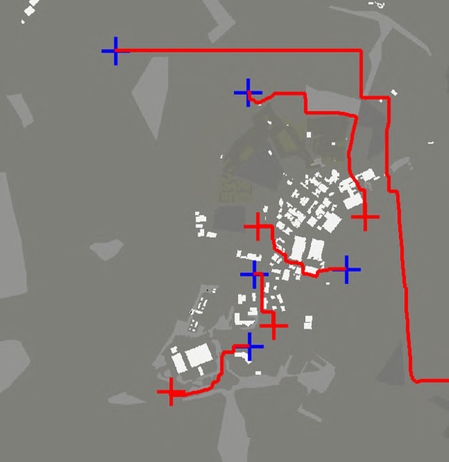
</p>
<p align="center"><em>Figure 3.1 — Pathfinding using classification-based weightings</em></p>

<p align="center">
  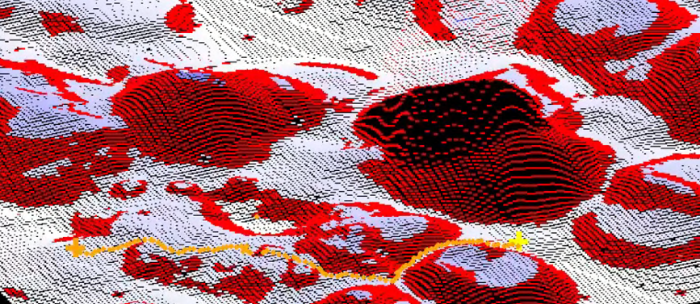
</p>
<p align="center"><em>Figure 3.2 — Isometric view of terrain grid with steepness threshold and pathfinding path</em></p>

### Simulation Environment (UE5)

A 3D simulation environment was built using Unreal Engine 5 (UE5). Pre-existing map information from OpenStreetMap was imported: building and forest polygons were collected for a given location, imported into UE5's data table system, and turned into 3D splines. UE5's Procedural Content Framework Toolkit (PCG) populated these splines with assets — tree assets within forest boundaries, wall assets along building outlines, and roof assets offset above them. Quixel Megascans assets (included with UE5) provided the trees and rocks. See the thesis Appendix A for detailed PCG blueprint node descriptions.

<p align="center">
  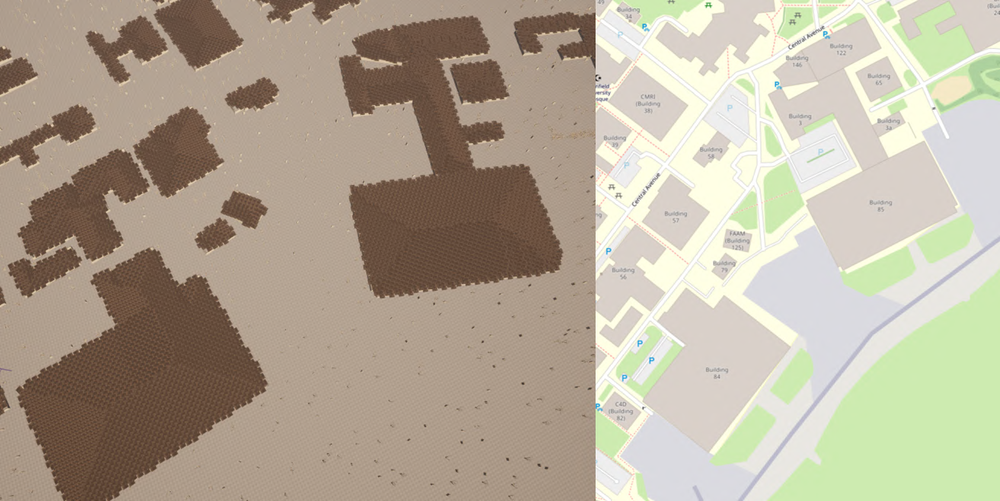
</p>
<p align="center"><em>Figure 3.3 — OpenStreetMap building polygons (right) imported into UE5 and populated with meshes as buildings (left)</em></p>

<p align="center">
  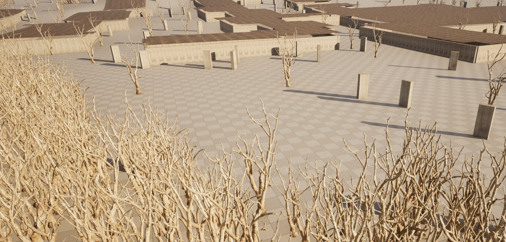
</p>
<p align="center"><em>Figure 3.4 — Bare-bones automatic generation of buildings and forests using OpenStreetMap polygons and UE5's PCG framework</em></p>

<p align="center">
  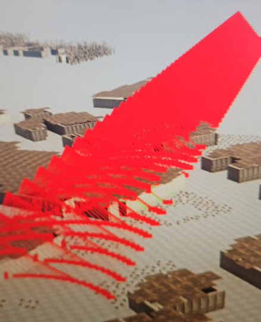
</p>
<p align="center"><em>Figure 3.5 — Airborne LIDAR ray-casting test in the simulation environment</em></p>

<p align="center">
  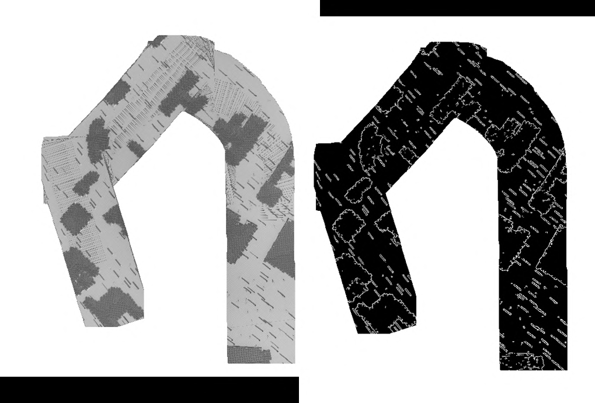
</p>
<p align="center"><em>Figure 3.6 — Overhead images stitched together (left) and with Canny edge detection applied (right)</em></p>

### Data Format Normalisation

All sensor data must be converted to 2D images at a consistent 1 m/pixel resolution:

| Data Source | Normalisation Method |
|---|---|
| Point cloud (Radar/LIDAR) | Rasterise to heightmap — highest z-value per 1m² cell |
| Overhead imagery | Scale so 1 pixel ≈ 1 meter |
| Polygon maps (OpenStreetMap) | Rasterise polygons to binary obstacle/free image |

Overhead imagery was scaled and stitched together using template matching itself (finding where a new image fits into the growing mosaic). Applying Canny edge detection to the stitched image improved matching effectiveness — the shapes and outlines of objects are shown more clearly. For vehicle point cloud data, the cloud was rasterised into a 1m/pixel grid — black pixels for obstacles (any point above a height threshold), white for clear, grey for unseen/unknown areas.

<p align="center">
  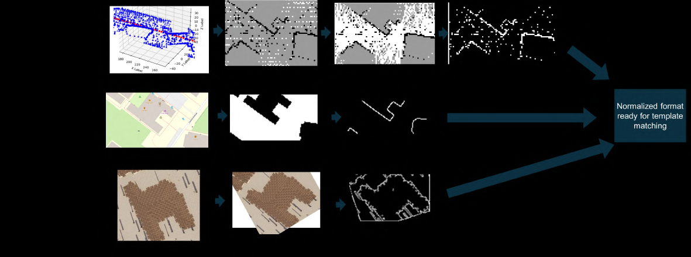
</p>
<p align="center"><em>Figure 3.7 — Methods of normalising multiple sensor maps to template-match-ready formats</em></p>

<p align="center">
  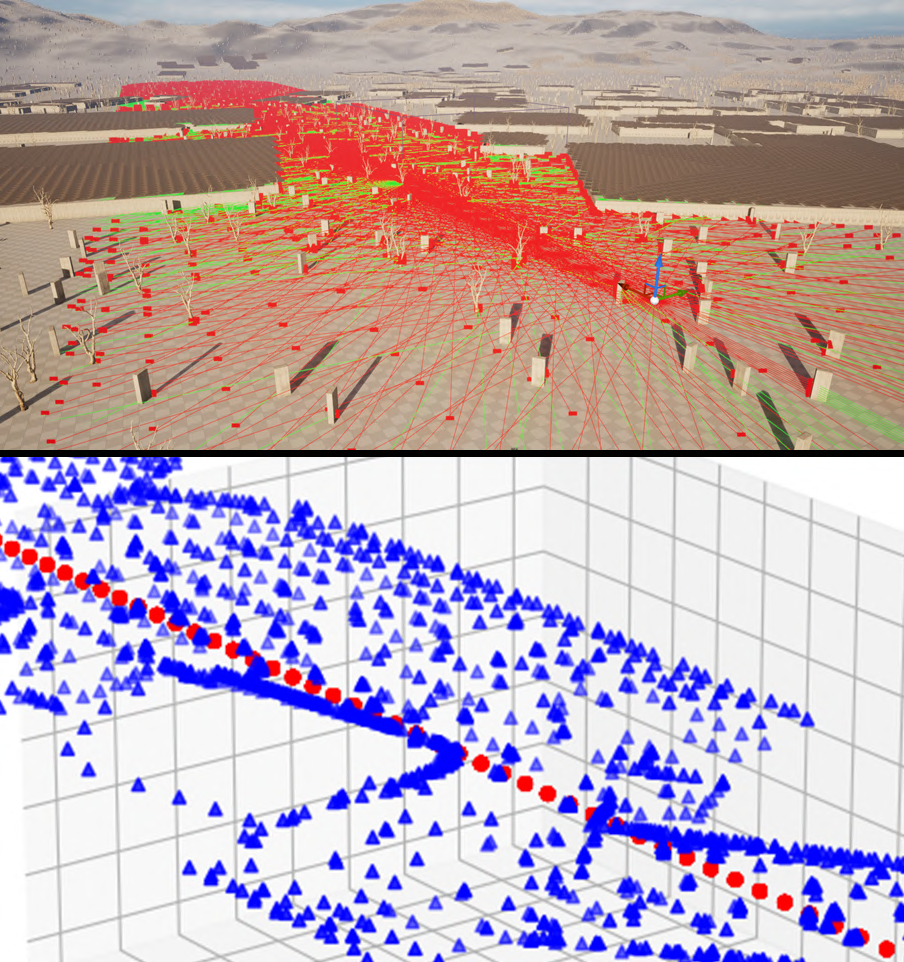
</p>
<p align="center"><em>Figure 3.8 — Ground-level ray-cast approximating low-resolution LIDAR (top) and resulting point cloud representation (bottom)</em></p>

### Free Space Estimation

To minimise the "unknown" area in the vehicle's obstacle grid, a simple raycasting algorithm was applied. It linearly interpolates between each sensor start-end position, stepping through each grid cell along that line. Any cell still marked unknown (grey) that it visits becomes marked as free (white). If it encounters an obstacle cell (black), it stops traversing further in that direction. This effectively carves out free paths in the grid wherever a start-end route is known.

<p align="center">
  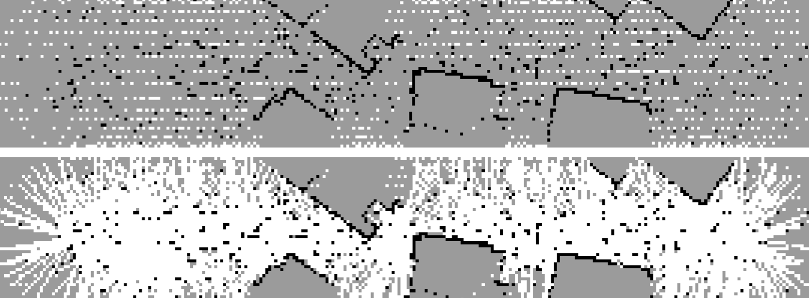
</p>
<p align="center"><em>Figure 3.9 — Point cloud data with simple height-based obstacle threshold (top) and grid enhanced with free space estimation algorithm (bottom)</em></p>

---

## Chapter 4 — Generalised Noise Robustness Testing

### Generalised Methodology

The aim was to determine the robustness of template matching to noise and errors in the template. The test used a simple binary map of Cranfield University and surroundings — black polygons of buildings against a white background, approximating a 1-meter-per-pixel map of a 2000-meter radius area derived from OpenStreetMap data.

A 1000×100 pixel subsection was cut out as the "vehicle sensor map" — representing a platform passing through the area with sensors of a fifty-meter range. This is 0.6% of the total target area. Two layers of noise were then added to simulate imperfect sensor data:

<p align="center">
  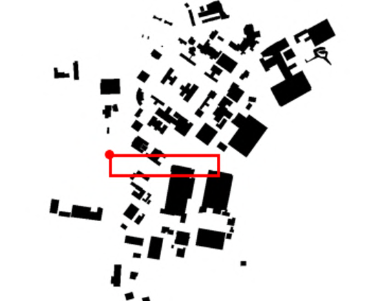
</p>
<p align="center"><em>Figure 4.1 — OpenStreetMap-derived polygon map of Cranfield University and surroundings</em></p>

### Noise Types

**Obstacle error noise (Perlin):** Flips obstacle/free pixel classification to the opposite value. A pixel with a building (black) might be flipped to white, representing sensor misclassification or an obstacle that is no longer present. Perlin noise was used rather than salt-and-pepper to produce spatially coherent regions of error, more accurately representing real sensor deviations.

**Unknown area noise (Perlin):** Pixels are coloured grey (value 127) regardless of the underlying content, representing areas where data was not gathered — obscured by obstacles, outside the vehicle's field of view, etc.

The amount of noise was quantified by the percentage of area affected — a fifty percent level of error noise means fifty percent of the area was flipped to the opposite value.

<p align="center">
  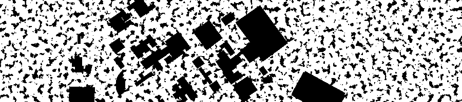
</p>
<p align="center"><em>Figure 4.2 — Example subsection with low-level obstacle error and unknown area salt-and-pepper noise</em></p>

<p align="center">
  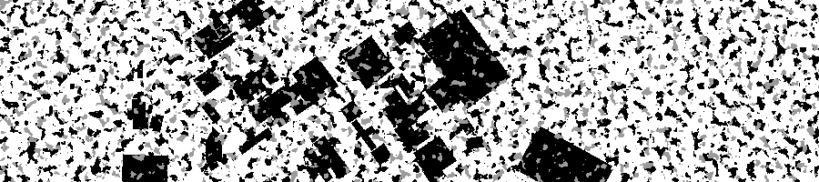
</p>
<p align="center"><em>Figure 4.3 — Example subsection with added Perlin obstacle error noise (more spatially coherent)</em></p>

### Template Matching Algorithm

Template matching was performed using `TM_CCOEFF_NORMED` from the OpenCV library. The process works by "sliding" the template over the target image and calculating a normalised cross-correlation score for each position. The pixel with the highest score is chosen as the match location. Since the original subsection location in the target image is known, the match accuracy can be directly verified.

### Generalised Results

Successful matches were achieved with noise levels as high as a combination of **85% obstacle noise and 85% unknown area noise** simultaneously. Longer and thinner subsections of the same surface area matched better than square subsections — these contain transitions between areas sparse and dense with buildings, providing a much more distinct "fingerprint" of the area. This is ideal for long-distance navigation where the area scanned by a vehicle will naturally be long and thin.

<p align="center">
  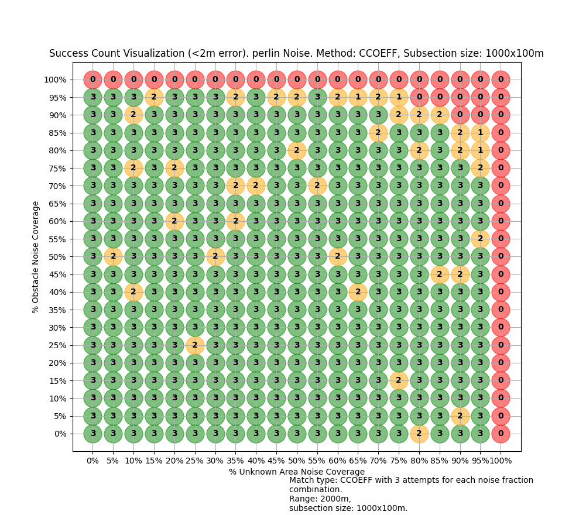
</p>
<p align="center"><em>Figure 4.4 — Generalised testing success count over 3 attempts with varying Perlin noise levels (green = all 3 matched, red = 0 matched)</em></p>

<p align="center">
  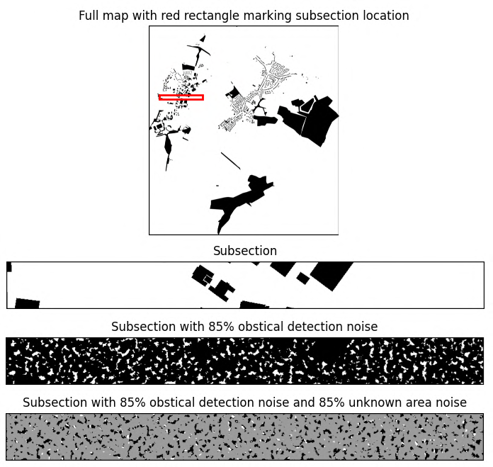
</p>
<p align="center"><em>Figure 4.5 — Map and subsection used for analysis, showing highest noise levels (85%/85%) for a successful match</em></p>

---

## Chapter 5 — Simulated Radar Localisation Testing

### Simulation Framework

A high-fidelity simulation was built in UE5. A 2km × 2km terrain was sculpted with hills, valleys, trees, and rocks (no buildings or other clearly defined landmarks). Trees and rocks were placed using UE5's PCG system with Quixel Megascans assets. The terrain was sparse and unstructured — the hardest case for localisation.

<p align="center">
  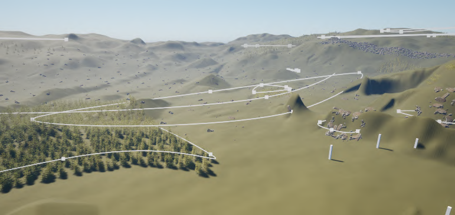
</p>
<p align="center"><em>Figure 5.1 — Screenshot of UE5 simulation environment using PCG to place forests and rocks</em></p>

<p align="center">
  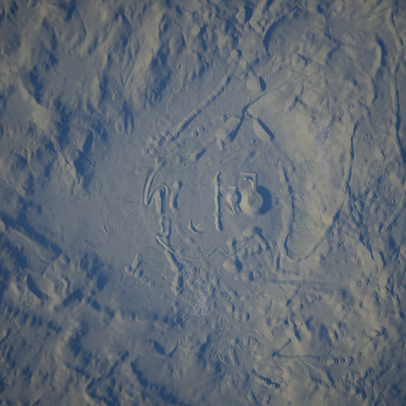
  &nbsp;&nbsp;
  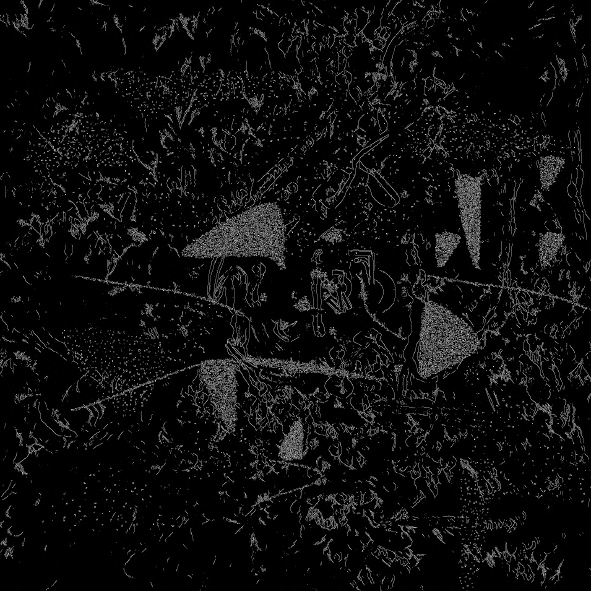
</p>
<p align="center"><em>Figure 5.2 — Top-down overhead image of the UE5 terrain (left) and with Canny edge detection applied (right)</em></p>

### Simulated Sensors

**Overhead imagery:** Captured from a camera at 10 km altitude looking straight down, with FOV scaled to produce 1 m/pixel resolution. This represents satellite or high-altitude aerial imagery.

**Radar point cloud:** A ray-casting object moved through the terrain at ~2m altitude, approximating the ZSignal from Zadar Labs — an example mid-range automotive radar:

| Parameter | Value |
|---|---|
| Azimuth FOV | 120° |
| Elevation FOV | 24° |
| Azimuth resolution | 2° |
| Elevation resolution | 4° |
| Max range | ~200 m |

The in-engine coordinates of ray cast hit locations and simulation time were exported to form the point cloud. No SLAM was performed — point clouds were used in their raw coordinate frame. Multiple datasets were gathered by moving the vehicle around the central area in different driving patterns, with point clouds saved in 5-second cumulative batches.

### Overhead Image Pre-Processing

Two steps only:

1. Convert RGB to greyscale
2. Apply Canny edge detection

```python
import cv2
grey = cv2.cvtColor(image, cv2.COLOR_BGR2GRAY)
edges = cv2.Canny(grey, threshold1=50, threshold2=150)
```

Edges encode as white, everything else as black. Terrain contours, tree boundaries, and rock outlines become visible features for matching.

### 3D Point Cloud Pre-Processing

Three stages, applied to each cumulative 5-second batch:

**Stage 1 — Heightmap rasterisation:** An array the size of the point cloud bounding box (in meters) is created. Each cell stores the highest z-value of any point falling within that 1m² area. Cells with no data are NaN.

**Stage 2 — Steepness calculation:** Each height value is converted to a steepness value — the magnitude of the gradient of the heightmap:

```
steepness(x,y) = sqrt( (dz/dx)² + (dz/dy)² )
```

Horizontal and vertical gradients are computed via numpy central differences (`np.gradient`). This step is critical: images of a hill do not change much with height, but the steepness changes at the bottom of the hill, at rock boundaries, at tree trunks. Even small obstacles with low absolute height produce high local steepness. With edge detection, the edges of steepness changes are emphasised — obstacles are highlighted even better.

**Stage 3 — Canny edge detection:** Applied to the normalised steepness map. This puts both data sources (visual and radar) into very similar formats for template matching.

NaN areas (no data) were handled two ways: **masked** (set to 127 = neutral grey) and **unmasked** (NaN regions filled via interpolation before edge detection). The unmasked/interpolated approach generally performed better.

<p align="center">
  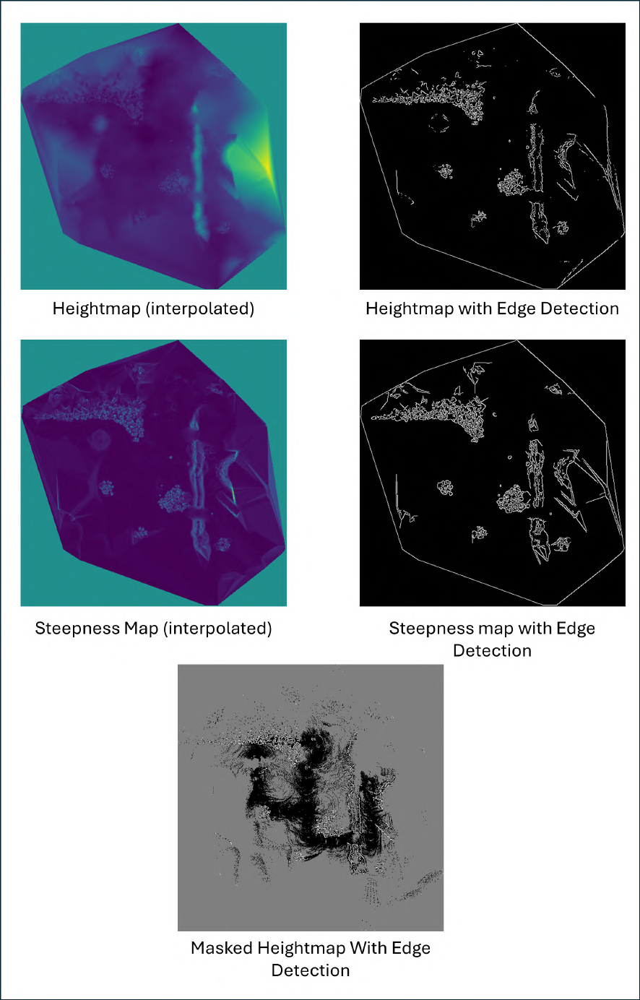
</p>
<p align="center"><em>Figure 5.3 — Various 3D pre-processing examples: heightmap (top-left), heightmap with edge detection (top-right), steepness map (middle-left), steepness with edge detection (middle-right), masked heightmap with edge detection (bottom)</em></p>

Three pre-processing variants were tested:

- **heightmap_edge_unmasked (HEU):** Edge detection directly on the interpolated heightmap
- **steepness_edge_unmasked (SEU):** Height → steepness → edge detection (recommended)
- **steepness_of_steepness_edge_unmasked (SOSEU):** Height → steepness → steepness again → edge detection

### Simulated Methodology

For each cumulative point cloud batch, the pre-processed edge-detected template was matched against the overhead edge-detected target using `TM_CCOEFF_NORMED`. The matched pixel coordinate was compared against the known ground truth origin to compute Euclidean distance error. An accuracy of under 10 meters was counted as a successful match — in practice, most successful matches were accurate to 1–2 meters. Results over 10 meters were completely wrong matches (the system either matches near-exactly or completely incorrectly). The main metric for comparison was the "known area" — the number of 1m² cells containing at least one point cloud value, expressed as a percentage of the total 2km × 2km target area.

### Simulated Results

**Steepness_edge_unmasked (SEU) was the clear best performer.** It typically achieved a correct match with under **0.3% of the target area** known (roughly 12,000 m² — a small patch of the 4,000,000 m² total). Most SEU datasets matched on the first or smallest batch/iteration.

**Heightmap_edge_unmasked (HEU) performed worse** because the distinct edges in the heightmap don't line up as well with satellite visual features. The steepness conversion better highlights obstacles: a low rock or bush may not create enough of a heightmap step for the edge detector, but the steepness of even a small height jump is locally very high.

**Steepness_of_steepness_edge_unmasked (SOSEU)** had little improvement over HEU. The double application of the steepness algorithm blurs data across neighbouring cells, distorting features only a couple of meters across.

Accuracy of successful matches was typically **1–2 meters**. The only tuning required was the Canny edge detection thresholds — different settings were used for visual versus 3D datasets, but within each type, the same setting was used consistently.

<p align="center">
  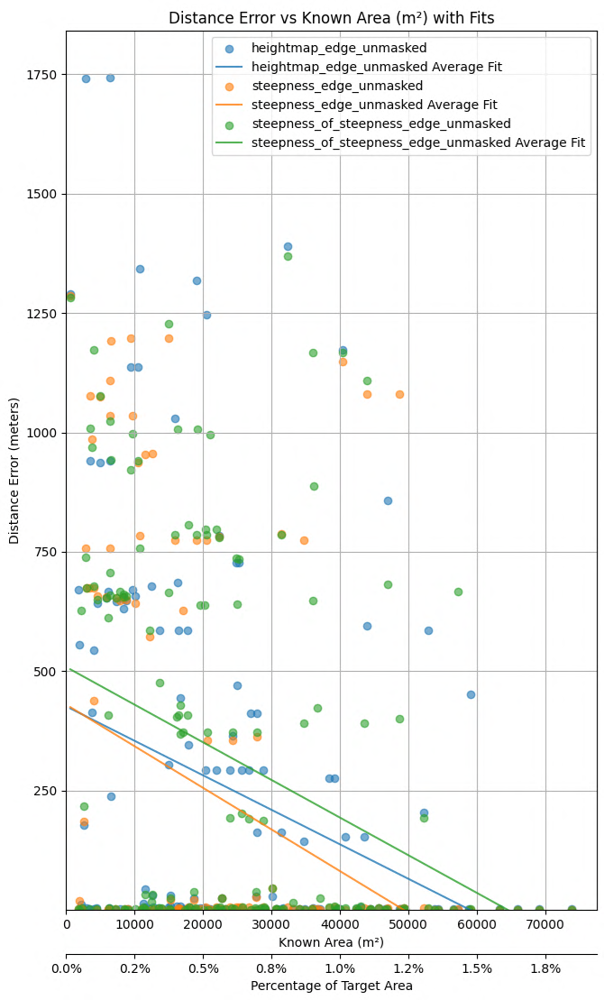
</p>
<p align="center"><em>Figure 5.4 — Distance error of template matching vs known area (all results including failures)</em></p>

<p align="center">
  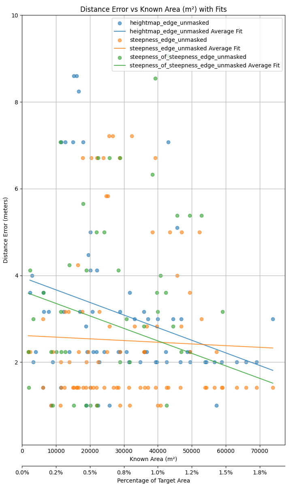
</p>
<p align="center"><em>Figure 5.5 — All successful matches (under 10m error) against known scanned area, with linear trendlines per pre-processing method</em></p>

<p align="center">
  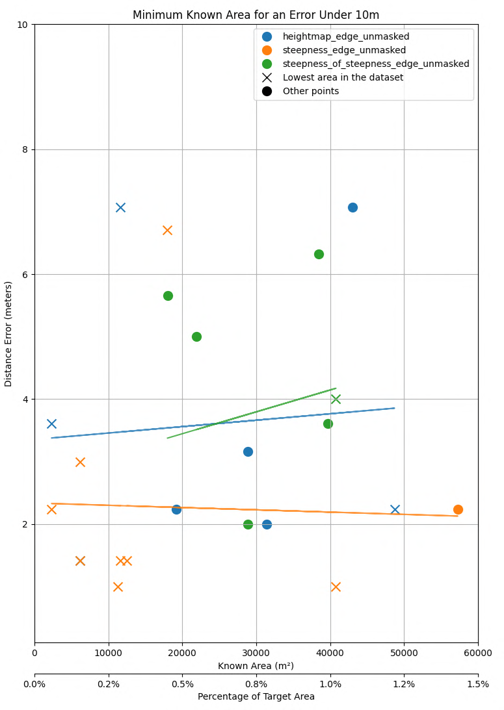
</p>
<p align="center"><em>Figure 5.6 — Each dataset's first iteration achieving a match error under 10m. X markers indicate the first batch in the dataset (match may have been possible with less data).</em></p>

---

## Chapter 6 — Discussion and Future Research

<p align="center">
  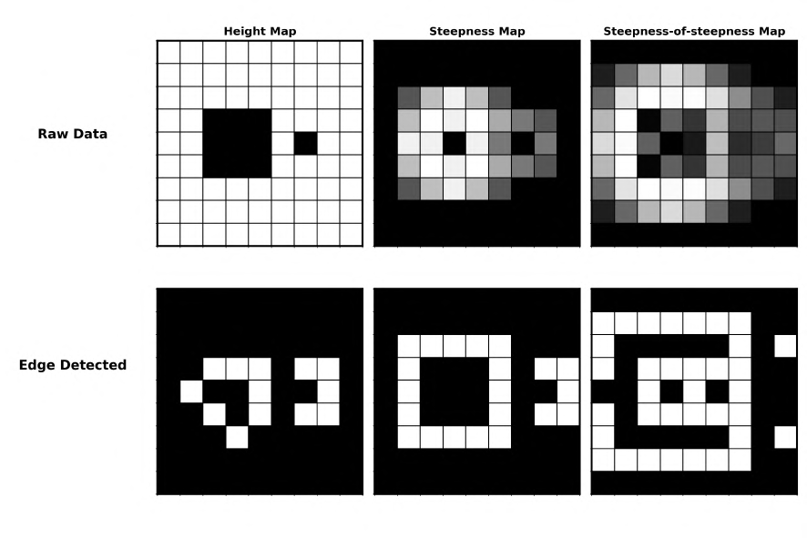
</p>
<p align="center"><em>Figure 6.1 — The effects of steepness and edge detection algorithm combinations: heightmap (left), steepness (centre), steepness-of-steepness (right). Raw data (top row) and edge-detected (bottom row).</em></p>

Several improvements are proposed:

**Binary search method:** The processed images were greyscale but the edge-detected data was effectively binary. Template matching in a true binary format would be significantly faster than 8-bit greyscale, though it leaves no room for additional data channels like an unknown area mask.

**Multi-resolution matching:** Matching at lower resolution first (e.g., areas with distinct large-scale features like forests and treelines), then refining at full resolution around the low-res match area. This would dramatically reduce compute time as map sizes increase.

**GPU parallelisation:** Template matching algorithms search every pixel independently, making them well-suited for GPU acceleration.

**SLAM correction:** The algorithm could detect cumulative SLAM drift by tiling a SLAM map and matching each section to overhead imagery. Sections that match a few meters off would indicate local errors.

**Classification channels:** Currently only geometry (edge shapes) is used. If both data sources could classify features (e.g., trees vs rocks), this could be encoded as additional channels within the 0–255 range.

**Adaptive edge detection tuning:** Automatically adjusting Canny sensitivity until a target proportion of pixels are detected as edges, compensating for environments with fewer features (e.g., grass fields).

**Real-world validation:** Results need verification with real sensor data — stereo cameras with freely available satellite imagery, or low-cost automotive radar.

---

## Chapter 7 — Conclusion

The system presents a novel approach for matching local 3D sensor data to wide-area satellite images with only a small portion of the map known to the sensing vehicle. The pre-processing methods are simple and implemented using only generic image-processing algorithms from widely used Python libraries and simple steepness calculations. The overall accuracy is encouraging, especially given the simplicity. With minimal tuning (only the edge detection step), the system has demonstrated robustness. Different edge detection settings were required for visual versus 3D datasets, but consistency within each type shows the approach is adaptable.

The use of Unreal Engine 5 to create large and detailed landscapes quickly also promises applicability to a wide range of research topics. The PCG framework allows rapid placement of forests and rocky landscapes that would be impractical to create manually.

---

## Replication Guide

The `replication/` folder contains everything needed to reproduce the two core experiments. All raw data is included, with scripts to regenerate every intermediate product from scratch.

### Prerequisites

**Python 3.10+** with:

```bash
cd replication
pip install -r requirements.txt
```

Contents of `requirements.txt`:

```
opencv-python>=4.5
numpy>=1.21
matplotlib>=3.5
pandas>=1.3
```

No GPU required. No deep learning frameworks. All scripts must be run from the `replication/` directory (they use relative paths to `data/`).

### Quick Start

```bash
cd replication

# 1. (Optional) Regenerate ALL derived data from raw inputs.
#    Pre-computed data is already included — skip if you just want results.
python generate_all_data.py

# 2. Run the UE5 simulated localisation test (Chapter 5 — main thesis result)
python run_ue5_test.py

# 3. Run the generalised noise-robustness test (Chapter 4)
#    Runtime: ~15-30 minutes (4 masking methods × 100 percentages × 10 trials each)
python run_generalised_test.py
```

---

### Script 1: `generate_all_data.py`

**Purpose:** Regenerates every intermediate product from the two raw inputs. Run this first if you want to recreate from scratch (or skip it — pre-computed outputs are included).

**Step 1 — Overhead edge image:**

Reads `data/visual_band/greyscale_1_pixel_per_square_meter.png` (2000×2000 px greyscale overhead image from UE5 at 1 m/pixel) and applies Canny edge detection (thresholds 50/150) to produce the target edge map.

**Step 2 — Radar heightmaps:**

Reads the 127 point cloud CSV files from `data/UE5_radar/formatted_data_out_loop_5/`. Each CSV has columns `x,y,z` in meters, with the filename encoding its timestamp as `robot_output_data_HH_MM_SS_ms.csv`. The script:

1. Accumulates CSVs into growing 5-second time windows (25 windows total)
2. For each window, rasterises the cumulative point cloud to a 1m/pixel heightmap (highest z per cell, NaN for empty cells)
3. Interpolates NaN gaps using OpenCV Navier-Stokes inpainting (`cv2.INPAINT_NS`)
4. Computes steepness: `steepness = sqrt((dz/dx)² + (dz/dy)²)` via `np.gradient`
5. Computes steepness-of-steepness (second derivative)
6. Applies Canny edge detection to all three maps in both masked (NaN→127) and unmasked (interpolated) variants
7. Writes `corner_info` metadata: real-world bounding box coordinates + unmasked pixel count

**Output:** 25 timesteps × 10 image subdirectories = ~250 images + 25 corner_info text files, all within `data/UE5_radar/heightmaps_formatted_data_out_loop_5/`.

**Key functions and what they do:**

| Function | Purpose |
|---|---|
| `generate_overhead_edges()` | Canny on overhead image |
| `combine_csv_files_cumulatively()` | Parses CSV timestamps, yields growing point cloud batches |
| `create_heightmap()` | Point cloud → 2D grid, max-z per cell |
| `interpolate_heightmap()` | Fills NaN gaps via cv2 inpainting |
| `compute_steepness()` | Gradient magnitude of heightmap |
| `save_edge_images()` | Canny + masked/unmasked variants |
| `save_corner_info()` | Writes real-world bounding box + area metadata |
| `process_one_timestep()` | Orchestrates the full pipeline for one time window |

---

### Script 2: `run_ue5_test.py`

**Purpose:** The primary thesis result (Chapter 5). Answers: *can a vehicle localise itself on a satellite image using only edge-detected radar heightmaps and template matching?*

**What it does:**

<p align="center">
  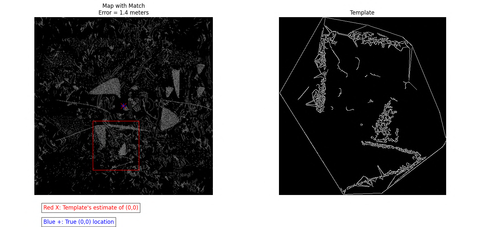
</p>
<p align="center"><em>Figure — Example template matching output: target map with matched region (left), template (right). Red X = template's estimate of origin, Blue + = true origin location.</em></p>

1. Loads the edge-detected overhead image and rotates it 90° clockwise (to match the radar coordinate frame)
2. Scans `data/UE5_radar/heightmaps_*/` for all `*_edge_unmasked/` subdirectories containing edge-detected template images
3. For each template image at each timestep:
   - Reads the corresponding `corner_info` file to get real-world bounding box and unmasked area
   - Runs `cv2.matchTemplate(target, template, cv2.TM_CCOEFF_NORMED)`
   - Extracts the best match location (`max_loc`)
   - Converts pixel match coordinates back to real-world meters using the corner_info offsets
   - Computes Euclidean distance error between matched and true positions (target centre = true origin)
4. Generates a scatter plot of error vs known area with linear regression trendlines per method
5. For the best match of each method, creates a 3-panel visualisation figure

**Outputs** (saved to `output/`):

| File | Description |
|---|---|
| `results_error_vs_area.png` | Scatter plot: localisation error (m) vs known scanned area (m²). Secondary x-axis shows percentage of total target area. Linear trendlines per pre-processing method. |
| `match_visualisations/vis_*.png` | Per-method 3-panel figures: (1) full overhead map with matched region boxed in green, red cross = matched origin, cyan cross = true origin, orange line = error vector; (2) zoomed overhead crop; (3) red/white overlay showing radar edges in red atop satellite edges in white |

**Key parameters:**

| Parameter | Value | Meaning |
|---|---|---|
| `target_area` | 2000 × 2000 | Total overhead area in pixels (= m²) |
| `max_y_value` | 10 | Matches over 10m error are considered failures |
| `must_contain` | `["unmasked"]` | Only tests the unmasked (interpolated) edge variants |

---

### Script 3: `run_generalised_test.py`

**Purpose:** Tests noise tolerance of template matching (Chapter 4). Uses real lidar scan templates from Cranfield University matched against the overhead edge-detected satellite image.

**What it does:**

1. Loads the edge-detected overhead target (same image, rotated 90° clockwise)
2. Loads all template PNG files from `data/3d_scan/` subdirectories — these are pre-processed real lidar scans in narrow (201×201m) and wide (1001×1001m) variants, across multiple processing stages (interpolated, steepness, edge-detected, etc.)
3. For each template, for each of 4 masking methods, sweeps masking percentage from 0% to 100% in 1% increments:
   - Applies the masking method to the template (masked pixels set to 127 = neutral grey)
   - Runs template matching 10 times per percentage level (different random masks each time)
   - Records mean distance error at each percentage level
4. Generates example images of 75% masking for each method
5. Plots results as 4×2 subplots: masked template examples (left column) and error vs masking percentage (right column)

**Masking methods:**

| Method | Description |
|---|---|
| `random` | Each pixel has an independent probability of being masked |
| `boundary` | Masks inward from the edges, leaving a central unmasked square |
| `central` | Masks a square region in the centre of the template |
| `block` | Divides template into a 3×3 grid, masks a random block within each grid cell |

**Key parameters:**

| Parameter | Value | Meaning |
|---|---|---|
| `num_matches_per_point` | 10 | Trials per percentage level for averaging |
| `percentage_interval` | 1 | Masking percentage increment |
| `y_axis_cap` | 10 | Plot y-axis maximum (meters) |
| `threshold_80_percent` | 10 | Filtering: templates shown if <10m error at 80% masking |

**Template coordinate systems:** Two template sizes are defined with known real-world bounding boxes (`TEMPLATE_INFO` dict). The `calculate_real_origin_offset()` function converts from template pixel coordinates to real-world meters relative to the target centre.

**Runtime:** ~15–30 minutes depending on hardware.

---

### Data Format Reference

**Point cloud CSVs** (`data/UE5_radar/formatted_data_out_loop_5/`):

```csv
x,y,z
-25.84158024,20.95248443,0.10724800999999999
-26.81975555,19.08902308,0.07017977
...
```

Columns are in meters in the UE5 engine coordinate frame. Filename encodes timestamp: `robot_output_data_HH_MM_SS_ms.csv`.

**Corner info files** (`corner_info/corner_info_NNNNN_seconds.txt`):

```
Top-left: (-93.0, 137.0)
Top-right: (143.0, 137.0)
Bottom-left: (-93.0, 368.0)
Bottom-right: (143.0, 368.0)
Unmasked Area (in pixels): 1828
```

Coordinates are in real-world meters (engine units). The Y-axis is inverted so that image row 0 = top of the real-world area. "Unmasked Area" counts the number of 1m² cells that contain at least one point cloud value.

---

### Directory Structure

```
replication/
├── README.md
├── requirements.txt
├── generate_all_data.py                ← Regenerates ALL derived data from raw inputs
├── run_ue5_test.py                     ← Main experiment: radar localisation (Ch. 5)
├── run_generalised_test.py             ← Noise robustness experiment (Ch. 4)
│
├── data/
│   ├── visual_band/
│   │   ├── greyscale_1_pixel_per_square_meter.png          ← RAW: 2000×2000 overhead image
│   │   └── edges_greyscale_1_pixel_per_square_meter.png    ← DERIVED: Canny edge target
│   │
│   ├── UE5_radar/
│   │   ├── formatted_data_out_loop_5/              ← RAW: 127 point cloud CSV files
│   │   └── heightmaps_formatted_data_out_loop_5/   ← DERIVED: 25 timesteps of processed maps
│   │       ├── corner_info/                         ← Bounding box + area metadata per timestep
│   │       ├── heightmap/                           ← Coloured heightmap PNGs
│   │       ├── heightmap_edge_masked/               ← Canny edges, NaN→127
│   │       ├── heightmap_edge_unmasked/             ← Canny edges, interpolated
│   │       ├── steepness/                           ← Gradient magnitude PNGs
│   │       ├── steepness_edge_masked/               ← Canny of steepness, NaN→127
│   │       ├── steepness_edge_unmasked/             ← Canny of steepness, interpolated (BEST)
│   │       ├── steepness_of_steepness/              ← Second-order gradient PNGs
│   │       ├── steepness_of_steepness_edge_masked/
│   │       └── steepness_of_steepness_edge_unmasked/
│   │
│   ├── 3d_scan/                                     ← Real lidar templates (Cranfield area)
│   │   ├── interpolated/                            ← Interpolated heightmaps (narrow + wide)
│   │   ├── interpolated_edge/                       ← Canny edges of interpolated heightmaps
│   │   ├── masked/                                  ← NaN-masked heightmaps
│   │   ├── steepness/                               ← Gradient magnitude maps
│   │   ├── steepness_edge/                          ← Canny edges of steepness
│   │   ├── steepness_of_steepness/                  ← Second-order gradients
│   │   └── steepness_of_steepness_edge/             ← Canny of second-order gradients
│   │
│   └── masking_examples/                            ← Auto-generated by run_generalised_test.py
│
└── output/                                          ← Generated by run_ue5_test.py
    ├── results_error_vs_area.png                    ← Statistical results plot
    └── match_visualisations/                        ← Per-method overlay figures
```

---

## Key Equations

**Normalised Cross-Correlation (TM_CCOEFF_NORMED):**

```
R(x,y) = Σ[T'(x',y') · I'(x+x', y+y')] / sqrt(Σ[T'²] · Σ[I'²])
```

Where T' and I' are zero-mean template and image patches.

**Steepness (gradient magnitude):**

```
steepness(x,y) = sqrt( (dz/dx)² + (dz/dy)² )
```

Computed via numpy central differences.

**Heightmap rasterisation:**

```
grid_cell(x,y) = max(z)  where  (x,y) = round(point_x - min_x), round(point_y - min_y)
```

**Interpolation:** cv2.inpaint with INPAINT_NS (Navier-Stokes biharmonic smoothness).

**Distance error:**

```
error = sqrt( (matched_x - true_x)² + (matched_y - true_y)² )
```

---

## Citation

```bibtex
@mastersthesis{buchan2024template,
  title     = {Template Matching for Correlation and Localisation of Multiple
               Sensor Types in Unstructured Environments for Traversability Assessment},
  author    = {Buchan, William},
  year      = {2024},
  school    = {Cranfield University},
  department= {School of Aerospace, Transport and Manufacturing},
  type      = {MSc by Research}
}
```

---

## License

This work is copyright Cranfield University 2024. Please refer to Cranfield University's policies for reproduction and use.
